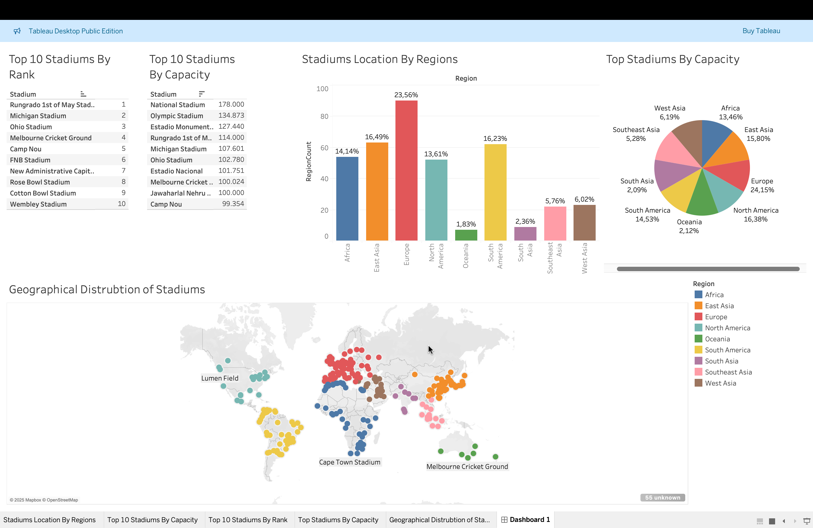

# Stadiums Data Pipeline

## Description
Football is the most widely followed sport across the world, leading countries to invest significantly in infrastructure, including stadiums. This project aims to provide a global analysis of stadiums, including their geolocation, capacity, and other key attributes.

Additionally, this project served as an introduction for me to the Azure ecosystem, as I have primarily worked with Google Cloud Platform (GCP) in the past. The main objective was to gain familiarity with Azure's services and capabilities by implementing a full data pipeline.

## Architecture & Workflow
This project follows a structured ETL (Extract, Transform, Load) pipeline, leveraging multiple Azure services:

1. **Data Extraction:**
   - A locally scheduled Apache Airflow DAG scrapes stadium-related data from Wikipedia and stores the extracted information as CSV files.

2. **Storage:**
   - The extracted CSV files are uploaded to **Azure Blob Storage**.

3. **Transformation:**
   - **Azure Data Factory (ADF)** processes the raw CSV files, performing data cleaning, transformations, and enriching the dataset where necessary.

4. **Data Storage:**
   - The transformed data is stored in **Azure Synapse Analytics (Data Lake)** for efficient querying and analysis.

5. **Data Visualization:**
   - A **Tableau Dashboard** is built using the cleaned dataset to provide insightful visual representations of the stadiums' data.

## System Architecture
For a visual representation of the pipeline, refer to the following diagram:

## Dashboard
The final analysis and visualizations are presented using Tableau. Below is a snapshot of the dashboard:

## Technologies Used
- **Azure Services:** Blob Storage, Data Factory, Synapse Analytics
- **Orchestration:** Apache Airflow
- **Data Extraction:** Python (Web Scraping)
- **Data Visualization:** Tableau

## Future Improvements
- Automate the entire pipeline deployment using **Terraform** or **Bicep**.
- Implement **incremental data ingestion** instead of full scrapes.
- Integrate **Azure Machine Learning** to derive predictive insights on stadium capacities and crowd trends.
- Expand the dataset with **API-based** sources for more comprehensive stadium data.

## How to Run the Project
1. Ensure you have **Apache Airflow** installed and configured.
2. Run the Airflow DAG to scrape data and upload it to Azure Blob Storage.
3. Configure **Azure Data Factory** to pick up the CSV files and process them.
4. Load the transformed data into **Azure Synapse Analytics**.
5. Connect **Tableau** to Synapse Analytics and build dashboards for analysis.

---
This project helped me understand Azure's data engineering ecosystem while analyzing global football stadiums. Any feedback or contributions are welcome!

P.S: Note that this inspiration from this project came from https://www.youtube.com/watch?v=tKIXUqz17W8&t=4s

